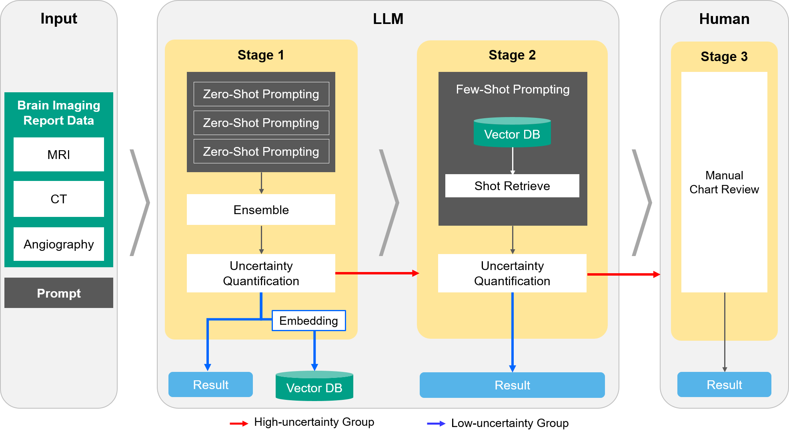

# Confidence-Linked and Uncertainty-Based Staged Framework for Phenotype Validation Using Large Language Models

## Overview

CLUES (Confidence-Linked and Uncertainty-Based Staged) framework is a three-stage system designed to classify cases for disease of interest while optimizing efficiency and reliability through uncertainty quantification and selective human review. It integrates Large Language Models (LLMs) with entropy-based uncertainty measures to enhance the accuracy and consistency of phenotype validation in large-scale datasets. As a case study, we applied CLUES to imaging reports to assess its performance in identifying stroke disease in hospitalized patients.

Stage 1: Zero-Shot + Ensemble
- The system first applies zero-shot LLM prompting to classify hospitalization cases based on imaging reports.
- Each case is evaluated three times with ensemble averaging to enhance stability.
- Uncertainty is quantified by measuring entropy from the model’s confidence scores.
- Cases with high uncertainty proceed to Stage 2 for further refinement.

Stage 2: Few-Shot + RAG 
- High-uncertainty cases from Stage 1 are re-evaluated using few-shot prompts.
- The system retrieves low-uncertainty examples from Stage 1 to guide the model’s reasoning and improve classification accuracy.
- Cases that remain uncertain after this stage move on to manual review.

Stage 3: Manual Chart Review for Remaining Uncertain Cases
- Cases that remain uncertain after automated processing undergo manual review by physicians.



## Features

- Automated analysis of medical imaging reports
- Multi-stage classification process
- Entropy-based uncertainty handling
- Integration of Zero-Shot and Few-Shot learning
- RAG-based knowledge enhancement
- Comprehensive evaluation system

## Requirements

- Python 3.11.9
- OpenAI API key
- Required Python packages (see requirements.txt)

## Installation

1. Clone the repository:
```bash
git clone https://github.com/1eetnals/clues.git
cd clues
```

2. Install dependencies:
```bash
pip install -r requirements.txt
```

3. Set up your OpenAI API key:
   
   You can set up your OpenAI API key in one of two ways:

   a. Using environment variable:
   ```bash
   export OPENAI_API_KEY='your-api-key-here'
   ```

   b. Using a .env file in the project root:
   ```bash
   OPENAI_API_KEY=your-api-key-here
   ```
   The system will automatically load the API key from the .env file if it exists.

## Usage

1. Prepare your data file (Excel format) with the following columns:
   - Patient ID
   - Imaging Type (MRI/CT/ANG)
   - Report Text

2. Run the classification system:
```bash
python main.py --data_file Data.xlsx --sample_size 30 --use_gpu
```

### Command Line Arguments

- `--data_file`: Path to the input Excel file (required)
- `--sample_size`: Number of samples to process (default: 30)
- `--use_gpu`: Enable GPU acceleration if available (optional)
- `--output_dir`: Output directory path (default: 'output')

## Output Files

The system generates several output files in the specified output directory:

1. Stage 1 Results:
   - `Stage1_result.xlsx`: Initial classification results
   - `Stage1_high_entropygroup.xlsx`: Cases requiring further analysis
   - `Stage1_low_entropygroup.xlsx`: Confirmed cases

2. RAG Datasets:
   - `MRI.csv`: MRI reference data
   - `CT.csv`: CT reference data
   - `ANG.csv`: Angiography reference data

3. Stage 2 Results:
   - `Stage2_result.xlsx`: Secondary classification results
   - `Stage2_high_entropygroup.xlsx`: Uncertain cases
   - `Stage2_low_entropygroup.xlsx`: Confirmed cases

4. Final Results:
   - `Stage3_result.xlsx`: Combined final classification results

## System Architecture

For detailed information about the system architecture, please refer to:
- [System Structure](documents/structure.md)
- [System Architecture](documents/architecture.md)

## Contributing

1. Fork the repository
2. Create your feature branch (`git checkout -b feature/AmazingFeature`)
3. Commit your changes (`git commit -m 'Add some AmazingFeature'`)
4. Push to the branch (`git push origin feature/AmazingFeature`)
5. Open a Pull Request

## License

This project is licensed under the MIT License

## Contact

Project Link: https://github.com/1eetnals/clues 
